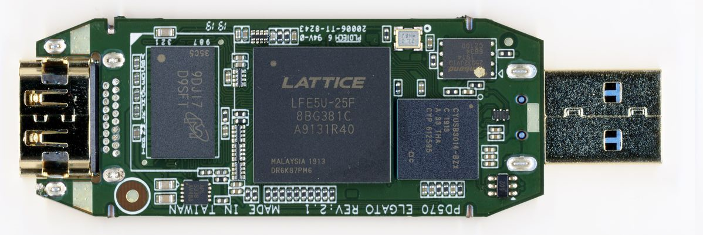
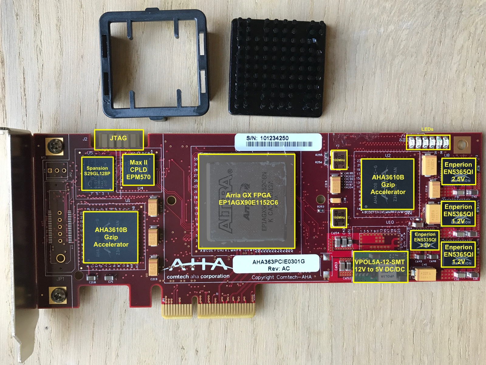
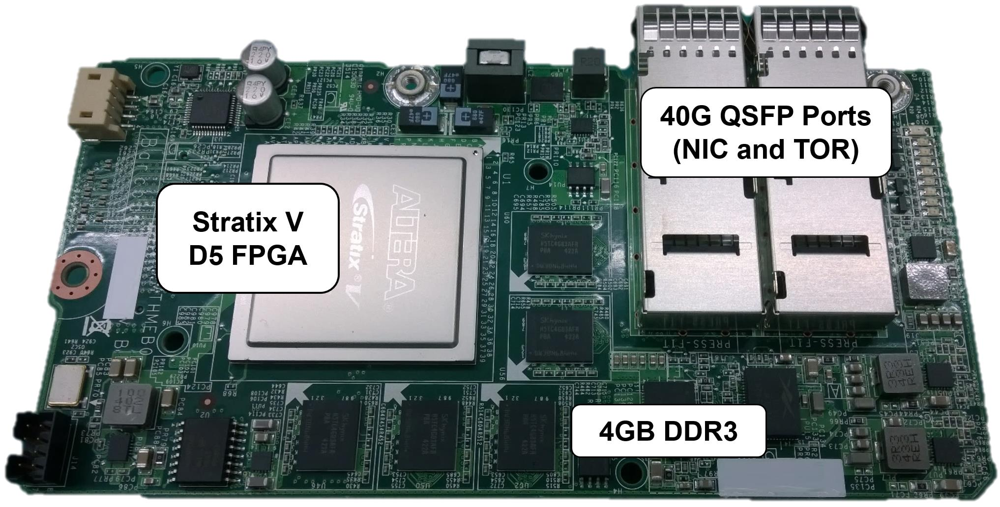
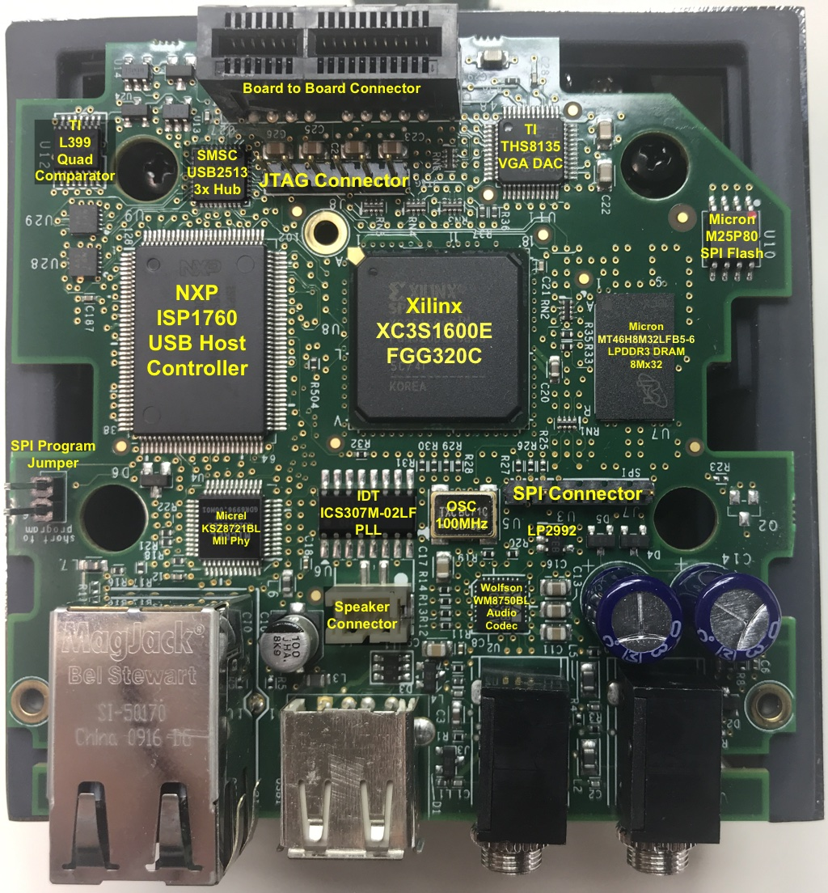
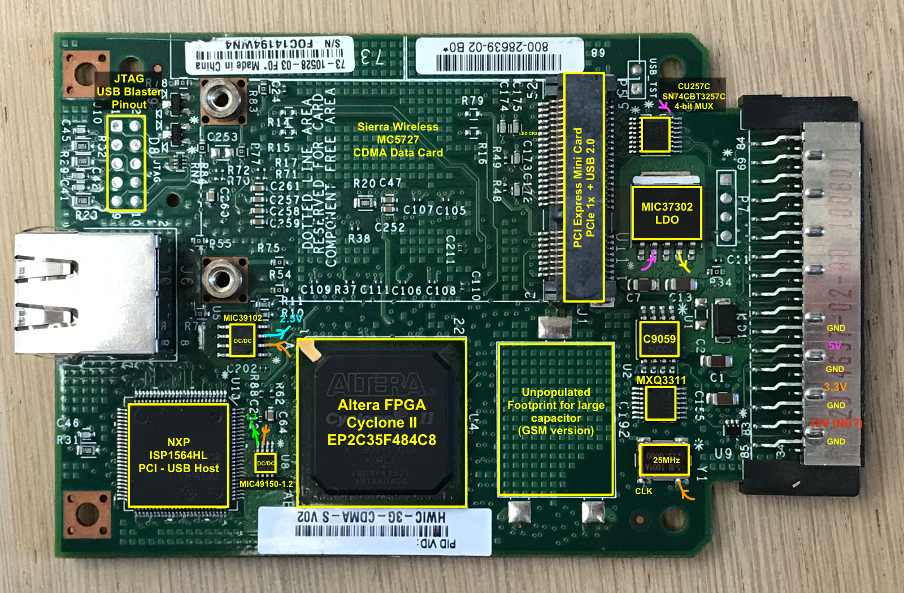
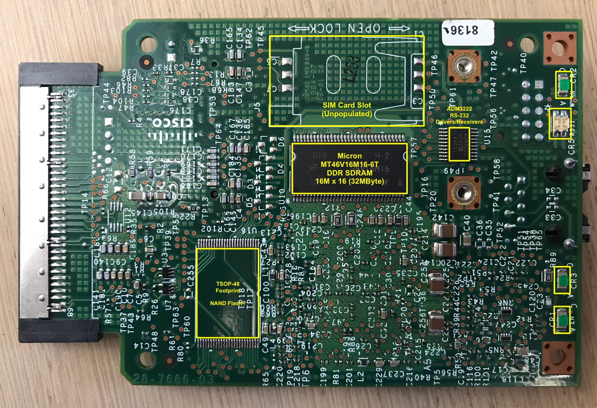

# List of FPGA boards

List of Repurposed FPGA boards which getting Second life in DYI or Hobby projects

<!--
* https://joelw.id.au/FPGA/CheapFPGADevelopmentBoards
* https://github.com/kelu124/awesome-latticeFPGAs
* https://hackaday.io/project/159853-fpga-board-hack
-->

URL: https://github.com/iDoka/awesome-fpga-boards

## ToC

todo

## Antminer S9 Control Board

* [EBAZ4205 (Xilinx XC7Z010CLG400)](https://github.com/xjtuecho/EBAZ4205)

## Colorlight Lattice ECP5

* [Linsn RV901T HUB75 LED "Receiver Card" Reverse Engineering](https://github.com/q3k/chubby75)
  * [Colorlight 5A-75B V6.1 Hardware](https://github.com/q3k/chubby75/blob/master/5a-75b/hardware_V6.1.md)
  * [Colorlight 5A-75B V7.0 Hardware](https://github.com/q3k/chubby75/blob/master/5a-75b/hardware_V7.0.md)
  * [Colorlight 5A-75B V8.0 Hardware](https://github.com/q3k/chubby75/blob/master/5a-75b/hardware_V8.0.md)
  * [Colorlight 5A-75E V6.0 Hardware](https://github.com/q3k/chubby75/blob/master/5a-75e/hardware_V6.0.md)
  * [Colorlight 5A-75E V7.1 Hardware](https://github.com/q3k/chubby75/blob/master/5a-75e/hardware_V7.1.md)
  * [Linsn RV901T HUB75](https://github.com/q3k/chubby75/tree/master/rv901t)
* [ColorLight 5A-75B](https://github.com/enjoy-digital/colorlite)
* [Notes for Colorlight-5A-75B](https://github.com/kholia/Colorlight-5A-75B)
* [Collection of tools made while messing with the Colorlight 5A-75B V7.0](https://github.com/kittennbfive/5A-75B-tools)
* [Collection of resources on the Colorlight FPGA boards](https://github.com/TomKeddie/prj-colorlight-fpga/wiki)
* [PCB Adapters with 7 PMOD connectors for Colorlight 5A-75B](https://github.com/cyber-murmel/chubby-hat)

* [Colorlight i5](https://github.com/wuxx/Colorlight-FPGA-Projects)

## Elgato CameraLink 4K

* [LiTex on Elgato CameraLink 4K](https://github.com/enjoy-digital/camlink_4k)

## Comtech AHA363 PCIe Board

* [Reverse Engineering the Comtech AHA363 PCIe Gzip Accelerator Board](https://tomverbeure.github.io/2020/06/14/AHA363-Reverse-Engineering.html)

## MS Catapult card

* [ @rombik_su twitter thread](https://twitter.com/rombik_su/status/1250382904074608642)
* https://j-marjanovic.io/
  * [Stratix V accelerator card from eBay, part 1](https://j-marjanovic.io/stratix-v-accelerator-card-from-ebay.html)
  * [Stratix V accelerator card from eBay, part 2](https://j-marjanovic.io/stratix-v-accelerator-card-from-ebay-part-2.html)
* [Microsoft's Catapult v2 (Pikes Peak)](http://virtlab.occamlab.com/home/zapisnik/microsoft-catapult-v2)

## Panologic

* [PanoLogic Zero Client G1 reverse engineering info](https://github.com/tomverbeure/panologic)
* [PanoLogic Zero Client G2 reverse engineering project](https://github.com/tomverbeure/panologic-g2)

## Cisco HWIC-3G-CDMA

* [Reverse Engineering of the Cisco HWIC-3G-CDMA PCB (github)](https://github.com/tomverbeure/cisco-hwic-3g-cdma)
* [Reverse Engineering the Cisco HWIC-3G-CDMA (blog)](https://tomverbeure.github.io/2019/11/11/Cisco-HWIC-3G-CDMA.html)

## unsorted

none

## etc

Follow this root-repo for lastest updates: https://github.com/iDoka/awesome-fpga-boards

## Tags

#awesome
#awesome-list
#fpga
#altera
#lattice
#xilinx
#zynq
#intel
#pci-e
#qsfp
#ethernet
#jtag
#bmc
#microsoft
#ecp5
#colorlight
#5a-75b
#chubby75
#elgato
#cisco

